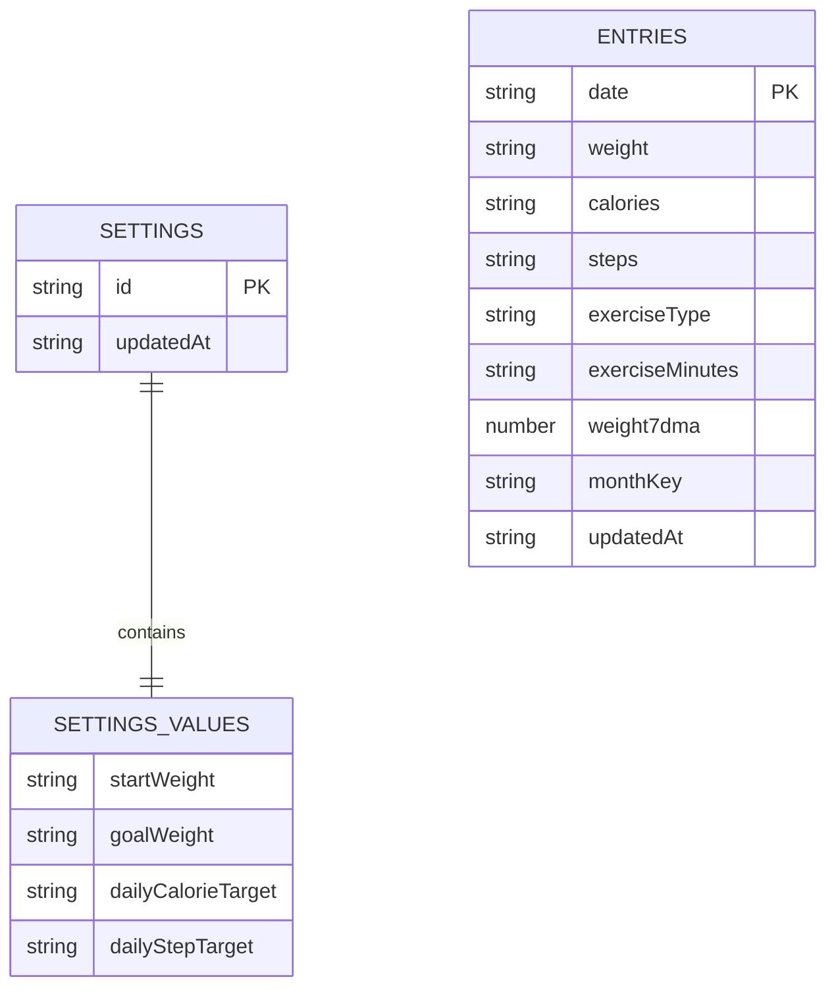

# LeanLog

[](https://github.com/lumachroma/leanlog/actions/workflows/deploy-pages.yml)

**LeanLog** is a personal weight-loss operating system built for real life.
A calm weight-loss tracker for real life - focused on consistency, forgiving trends, and long-term progress without pressure or noise.
Fast daily logging, stable trend tracking, and lightweight progress reviews designed for sustainable fat loss over the long term.

## Technical Description

LeanLog is a personal, local-first weight-loss operating system built for real life. It is designed for fast daily logging, lightweight progress review, and sustainable long-term fat-loss work without turning into compliance-heavy software. Iteration 1 focuses on the basics only: daily weight, calories, steps, exercise details, a structured four-section dashboard, a Recharts-based dual-line weight trend chart, weekly and monthly averages, goal settings, CSV backup/restore for daily logs, and installable PWA support.

The app is designed to stay minimal. There is no backend, no authentication, and no cloud dependency. Data is stored locally in the browser with IndexedDB.

## Features

- Dashboard with four structured sections: Today's Snapshot, Weight Trend, Daily Consistency, and Progress Toward Your Goal
- Recharts-based dual-line weight trend chart showing daily weight and 7-day moving average
- Rolling 30-day Daily Consistency charts for calories and steps with on-target, near-target, off-target, logged, and missing states plus hit rate and streak summaries
- Goal progress bar visualizing start weight, current weight, and goal weight
- Daily history page for creating, editing, and deleting log entries
- Weekly and monthly average pages for longer-view summaries
- Settings page for start weight, goal weight, daily calorie target, daily step target, and daily-log CSV import/export
- Local-first persistence using Dexie on top of IndexedDB
- Installable PWA with cached app shell assets for a more app-like experience
- Lightweight view-model driven app structure with focused component boundaries
- Test coverage for app routing, view-model logic, settings flow, daily log flow, and history CRUD behavior

## Tech Stack

- React 19
- Vite 8
- JavaScript only
- Tailwind CSS v4
- shadcn/ui
- Zustand for app state
- Dexie for IndexedDB persistence
- Recharts for line charts
- Vitest and Testing Library
- ESLint

## Getting Started

### Prerequisites

- Node.js 20 or newer recommended
- npm 10 or newer recommended

### Installation

```bash
npm install
```

### Start The Development Server

```bash
npm run dev
```

Vite will print the local development URL in the terminal, typically `http://localhost:5173`.

## Available Scripts

```bash
npm run dev
```

Starts the Vite development server.

```bash
npm run build
```

Builds the production bundle into `dist/`.

```bash
npm run preview
```

Serves the production build locally.

```bash
npm run lint
```

Runs ESLint across the project.

```bash
npm test
```

Runs the Vitest suite once.

```bash
npm run test:watch
```

Runs Vitest in watch mode.

## GitHub Pages Deployment

LeanLog is configured to deploy as a GitHub Pages project site from this normal repo named `leanlog`.

- Workflow: [.github/workflows/deploy-pages.yml](/Users/nazrulhisham/Projects/learn/leanlog/.github/workflows/deploy-pages.yml)
- Published URL: https://lumachroma.github.io/leanlog/
- Pages-aware build path: `/leanlog/`

The GitHub Pages build uses the `/leanlog/` base path automatically when the `GITHUB_PAGES=true` environment variable is set, so manifest scope, start URL, and built asset URLs stay aligned with the published site.

To enable deployment:

1. Push this repository to GitHub.
2. Open the repository `Settings` page, then `Pages`.
3. Set `Source` to `GitHub Actions`.
4. Make sure the default branch is `main`.
5. Push to `main`, or manually run the `Deploy GitHub Pages` workflow.

Deployment checklist:

1. `Settings` -> `Actions` -> `General`: allow GitHub Actions to run.
2. `Settings` -> `Pages`: source is `GitHub Actions`.
3. `Settings` -> `Environments` -> `github-pages`: no blocking approval rules unless you want them.
4. Repository visibility and Pages settings allow the site to be published.

Once deployed, the PWA should install from https://lumachroma.github.io/leanlog/ with the correct GitHub Pages scope.

## Product Scope

Current Iteration 1 scope:

- Track daily weight, calories, steps, and exercise
- Show a focused, sectioned dashboard instead of a dense analytics surface
- Use a 7-day moving average and a dual-line weight chart to keep the trend emotionally calm and readable
- Surface consistency and goal progress visually without turning the product into accounting software
- Keep the experience local-first and fast
- Keep formulas and summaries forgiving so missed days do not break trends or punish the user
- Preserve a data model that can evolve later for sync and richer visualizations

Explicit non-goals for the current iteration:

- Authentication
- Cloud sync
- Social features
- Additional health metrics beyond the current four tracked values
- Expanded analytics beyond the existing dashboard summaries

## Project Structure

```text
src/
	components/app/      App shell, header, dashboard, history, and settings UI
	components/ui/       Reusable UI primitives
	hooks/               App view-model hooks
	lib/                 Dexie database helpers and derived metrics
	store/               Zustand store
	test/                Shared test setup, fixture barrel, and focused fixture modules
```

Key files:

- `src/lib/db.js`: Dexie schema, local date helpers, and persistence helpers
- `src/store/useAppStore.js`: Zustand store and app actions
- `src/hooks/useAppViewModel.js`: App-facing view-model logic
- `src/lib/metrics.js`: Shared dashboard calculations and chart-ready selectors built from entry and settings data
- `src/lib/dashboard-section-metrics.js`: Dashboard section view data shaping for snapshot, chart, and goal-progress props
- `src/lib/weight-trend-metrics.js`: Weight chart domain and latest-value derivation
- `src/lib/consistency-metrics.js`: 30-day consistency window, state classification, hit-rate, and streak derivation
- `src/lib/goal-progress-metrics.js`: Goal progress completeness and marker-position derivation
- `src/lib/daily-log-csv.js`: CSV parsing and export helpers for daily-log backups
- `src/components/app/DashboardSection.jsx`: Thin dashboard section renderer that composes the visual dashboard sections
- `src/components/app/DashboardSection.helpers.js`: Snapshot card copy, icon mapping, and setup-callout display helpers
- `src/components/app/WeightTrendChart.jsx`: Thin Recharts-backed dual-line weight chart renderer
- `src/components/app/WeightTrendChart.helpers.js`: Weight chart date formatting, responsive chart config, and empty-state copy
- `src/components/app/ConsistencyTrackingChart.jsx`: Thin calorie and step consistency renderer
- `src/components/app/ConsistencyTrackingChart.helpers.js`: Consistency display labels, classes, and summary copy
- `src/components/app/GoalProgressChart.jsx`: Thin start-to-goal progress renderer with current-weight marker
- `src/components/app/GoalProgressChart.helpers.js`: Goal-progress display copy helpers
- `src/App.jsx`: Top-level page composition and local page persistence
- `src/test/leanlog-test-fixtures.js`: Stable test-fixture barrel used by tests across the app
- `src/test/fixtures/`: Focused shared fixture families for settings, entries, derived data, store state, and app view-models

## Dashboard Architecture

The dashboard now follows a consistent split between data derivation and rendering:

- Pure calculations live in focused `src/lib/*-metrics.js` modules.
- Display-only copy, labels, icon selection, and class-name mapping live in colocated `src/components/app/*.helpers.js` files.
- React components stay thin and mostly render the derived model they receive.

This keeps chart logic easier to test, makes rendering components easier to read, and preserves the current local-first data flow without introducing broader architectural complexity.

## Dashboard Structure

The dashboard is intentionally split into four sections so the app stays readable under real-life conditions:

- Section 1: Today's Snapshot for weight trend, 7-day moving average, average calories, average steps, and goal progress
- Section 2: Weight Trend using daily weight plus 7-day moving average to keep fluctuations visible while the long-term direction stays clear
- Section 3: Daily Consistency using rolling 30-day adherence charts for calories and steps so each logged day stays visible instead of collapsing the view into a single average comparison
- Section 4: Progress Toward Your Goal showing the relationship between start weight, current trend, and goal weight

## Weight Trend View

The Weight Trend section keeps the daily signal visible without letting normal fluctuations dominate the story. It pairs raw daily weigh-ins with a calmer 7-day moving average so the chart still feels truthful, but easier to read over time.

The chart shows two lines:

- Daily weight: the honest day-to-day measurement, including normal short-term variation
- 7-day moving average: the smoothed trend line that keeps the longer direction readable even when weigh-ins are noisy or uneven

The section also surfaces the latest logged daily weight and the latest available 7DMA above the chart so the current state is visible at a glance.

The chart domain is derived from the actual logged values and padded slightly so the line does not feel cramped. If weight data is missing entirely, the section falls back to an empty state instead of rendering a misleading chart.

## Daily Consistency View

The Daily Consistency section no longer uses the older average-versus-target bar view. It now shows a rolling 30-day adherence chart for calories and steps so the dashboard answers a better question: not just whether your average is above or below target, but how consistently you are showing up day to day.

Each metric renders one square per day across the latest 30-day window and classifies that day into one of five states:

- On target: the logged value met the target for that metric
- Near target: the logged value landed close to the target without fully hitting it
- Off target: the logged value was outside the target range
- Logged: the day has data but no target is configured yet
- Missing: no entry exists for that metric on that day

Calories and steps use different target direction rules:

- Calories treat lower-or-equal values as on target
- Steps treat higher-or-equal values as on target

Alongside the daily squares, each chart also summarizes:

- Hit rate across logged days in the current 30-day window
- Current streak of on-target days
- Best on-target streak inside the window
- Average delta versus the configured target when a target exists

Missing days are tolerated by design. They stay visible in the chart, but they do not break the app or get counted as logged successes. This keeps the view psychologically lightweight while still making patterns visible over time.

## Progress Toward Your Goal View

The Progress Toward Your Goal section turns start weight, current weight, and goal weight into one simple progress view. Instead of showing a dense breakdown, it uses a single progress bar and marker so the dashboard answers the practical question of how far along the current trend is.

This section shows:

- Start weight: the baseline pulled from settings
- Current weight: the latest logged weight used as the live marker on the progress bar
- Goal weight: the target pulled from settings
- Progress percent: the portion of total start-to-goal distance already covered

The marker position is clamped to the valid range of the bar so edge cases do not break the layout. If start weight, goal weight, current weight, or progress percent is missing, the section falls back to an empty state and prompts the user to complete the required inputs first.

## Data Persistence

LeanLog stores data locally in the browser using IndexedDB through Dexie.

- The app can be installed as a PWA from supported browsers
- The app shell is cached for faster repeat loads and basic offline availability
- Settings are stored as a single profile record
- Daily entries are stored by date
- Hidden derived cells such as persisted 7DMA values are recalculated after entry changes
- Empty daily entries are not persisted
- Navigation state is also persisted locally so the app can reopen on the last active page
- Daily logs can be exported from Settings as CSV and imported back as a date-merged backup flow

If you clear site data in the browser, LeanLog data will be removed.

## Daily Log Data Structure

The daily log is the core record shape used by the app for both the in-memory entry draft and the persisted `entries` table. LeanLog intentionally keeps user-entered values lightweight and form-friendly: most editable fields are stored as strings, then parsed into numbers only when metrics and charts are calculated.

Daily log lifecycle rules:

- `date` is the record identity and uses local calendar format `YYYY-MM-DD`
- `weight`, `calories`, `steps`, and `exerciseMinutes` are stored as strings so the UI can tolerate partial input and blanks
- `exerciseType` is a short label chosen from the current supported options: Walking, Cycling, Strength, Running, Sports, Mobility, or Other
- `weight7dma` is derived, not directly user-entered; it is recalculated whenever entries are saved or deleted
- a daily log with all editable fields blank is treated as empty and is removed instead of being stored

| Field | Stored Type | Example | Source | Notes |
| --- | --- | --- | --- | --- |
| `date` | `string` | `2026-05-15` | user-selected day | Primary key for the entry record |
| `weight` | `string` | `78.4` | user input | Blank allowed; parsed later for metrics and charts |
| `calories` | `string` | `2100` | user input | Blank allowed; used in consistency and average calculations |
| `steps` | `string` | `8450` | user input | Blank allowed; used in consistency and average calculations |
| `exerciseType` | `string` | `Walking` | user input | Blank allowed; currently selected from fixed exercise options |
| `exerciseMinutes` | `string` | `45` | user input | Blank allowed; stored as text and parsed only when needed |
| `weight7dma` | `number \| null` | `78.91` | derived by app | Persisted hidden field for the trailing 7-day moving average |

Example daily log record:

```json
{
	"date": "2026-05-15",
	"weight": "78.4",
	"calories": "2100",
	"steps": "8450",
	"exerciseType": "Walking",
	"exerciseMinutes": "45",
	"weight7dma": 78.91
}
```

## IndexedDB Schema

The Dexie database is named `leanlog` and currently has two tables:

- `settings`, keyed by a single record id
- `entries`, keyed by day

Dexie store declaration:

```js
settings: '&id, updatedAt'
entries: '&date, monthKey, updatedAt'
```

### `settings` Table

LeanLog stores one settings document under the fixed id `profile`. The user-editable values live under a nested `values` object.

| Field | Stored Type | Example | Notes |
| --- | --- | --- | --- |
| `id` | `string` | `profile` | Primary key; there is only one settings record |
| `values.startWeight` | `string` | `92` | Blank allowed; used as the starting point for goal progress |
| `values.goalWeight` | `string` | `75` | Blank allowed; used for goal progress and distance remaining |
| `values.dailyCalorieTarget` | `string` | `2200` | Blank allowed; used by consistency tracking |
| `values.dailyStepTarget` | `string` | `10000` | Blank allowed; used by consistency tracking |
| `updatedAt` | `string` | `2026-05-15T10:42:13.511Z` | ISO timestamp for the most recent settings save |

Example settings record:

```json
{
	"id": "profile",
	"values": {
		"startWeight": "92",
		"goalWeight": "75",
		"dailyCalorieTarget": "2200",
		"dailyStepTarget": "10000"
	},
	"updatedAt": "2026-05-15T10:42:13.511Z"
}
```

### `entries` Table

Each persisted daily log is normalized into an entry record. Two extra fields are added during persistence: `monthKey` for grouping and `updatedAt` for bookkeeping.

| Field | Stored Type | Example | Notes |
| --- | --- | --- | --- |
| `date` | `string` | `2026-05-15` | Primary key; one record per day |
| `weight` | `string` | `78.4` | User-entered weight value |
| `calories` | `string` | `2100` | User-entered calorie value |
| `steps` | `string` | `8450` | User-entered step count |
| `exerciseType` | `string` | `Walking` | User-entered exercise label |
| `exerciseMinutes` | `string` | `45` | User-entered duration |
| `weight7dma` | `number \| null` | `78.91` | Derived trailing 7-day moving average |
| `monthKey` | `string` | `2026-05` | Derived grouping key used for month-based views |
| `updatedAt` | `string` | `2026-05-15T10:42:13.511Z` | ISO timestamp for the latest persistence pass |

Example persisted entry record:

```json
{
	"date": "2026-05-15",
	"weight": "78.4",
	"calories": "2100",
	"steps": "8450",
	"exerciseType": "Walking",
	"exerciseMinutes": "45",
	"weight7dma": 78.91,
	"monthKey": "2026-05",
	"updatedAt": "2026-05-15T10:42:13.511Z"
}
```

## Schema Diagram



## Persistence Behavior Summary

- On load, LeanLog reads the single settings record and all entry records from IndexedDB
- On settings save, the `settings` record is replaced with a fresh `updatedAt` timestamp
- On daily entry save or delete, all entries are recalculated so `weight7dma`, `monthKey`, and `updatedAt` stay consistent
- The UI keeps a Zustand `entryDraft` in memory, but only normalized entry records are written into IndexedDB
- The current page is remembered in localStorage, but it is not part of the IndexedDB schema

## Testing And Validation

The project uses Vitest with Testing Library for UI and view-model coverage.

Shared test data is organized into focused fixture modules under `src/test/fixtures/`. Tests should prefer the stable barrel export at `src/test/leanlog-test-fixtures.js` so fixture internals can keep evolving without causing broad import churn.

Pure dashboard derivation now also has focused lib-level coverage in files such as `src/lib/consistency-metrics.test.js`, `src/lib/weight-trend-metrics.test.js`, `src/lib/goal-progress-metrics.test.js`, and `src/lib/dashboard-section-metrics.test.js`, while component tests stay focused on rendered output and composition boundaries.

Recommended validation before merging meaningful changes:

```bash
npm test
npm run lint
npm run build
```

## Development Notes

- Use the `@` alias for imports from `src`
- Keep changes scoped to Iteration 1 unless a broader change is explicitly requested
- Prefer small local refactors over broad rewrites
- Preserve the current local-first data model

## Future Direction

The current app shape is intentionally narrow, but the architecture leaves room for later additions such as:

- sync-friendly persistence evolution
- richer charting
- mobile packaging
- broader automated test coverage

## License

This project is licensed under the MIT License. See [LICENSE](/Users/nazrulhisham/Projects/learn/leanlog/LICENSE).
