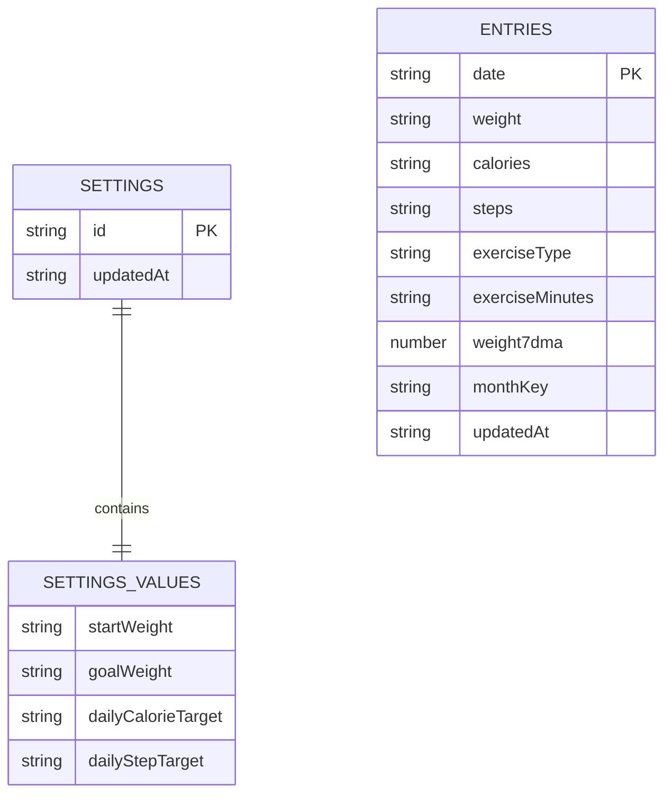

# LeanLog

[](https://github.com/lumachroma/leanlog/actions/workflows/deploy-pages.yml)

LeanLog is a calm, local-first weight-loss tracker built for fast daily logging and readable long-term progress. It keeps the surface small: dashboard insights, history editing, weekly and monthly averages, settings, and a short about page that explains the model.

There is no backend, no auth, and no cloud dependency. App data lives in the browser with Dexie on top of IndexedDB.

## Current App

- Dashboard with Today's Snapshot, Weight Trend, Daily Consistency, and Progress Toward Your Goal
- Daily history page for creating, editing, and deleting logs
- Weekly and monthly average summaries
- Settings for start weight, goal weight, daily calorie target, daily step target, and CSV import or export
- About page describing the product and dashboard logic
- Installable PWA with cached app shell assets and auto-updating service worker

## What Gets Tracked

- Weight
- Calories
- Steps
- Exercise type
- Exercise minutes

LeanLog also recalculates and persists a derived 7-day moving average for weight after entry changes and CSV imports.

## Tech Stack

- React 19
- Vite 8
- JavaScript
- Tailwind CSS v4
- shadcn/ui
- Zustand
- Dexie
- Recharts
- vite-plugin-pwa
- Vitest and Testing Library
- ESLint

## Architecture Notes

- `src/lib/db.js` owns IndexedDB persistence, entry normalization, and moving-average recalculation.
- `src/store/useAppStore.js` and `src/store/app-store-slices.js` own app state and actions.
- `src/hooks/useAppViewModel.js` and `src/hooks/app-view-model-sections.js` shape page-ready view models.
- `src/components/app/AppContent.jsx` lazy-loads the dashboard, history, averages, settings, and about pages.
- Dashboard derivation is split across focused modules in `src/lib/*-metrics.js` and thin renderers in `src/components/app`.
- CSV import and export live in `src/lib/daily-log-csv.js`.

## Development

Prerequisites:

- Node.js 20+
- npm 10+

Install dependencies:

```bash
npm install
```

Start the dev server:

```bash
npm run dev
```

Useful scripts:

```bash
npm run build
npm run preview
npm run lint
npm test
npm run test:watch
```

## Deployment

LeanLog is configured for GitHub Pages.

- Workflow: [.github/workflows/deploy-pages.yml](.github/workflows/deploy-pages.yml)
- Published URL: https://lumachroma.github.io/leanlog/
- GitHub Pages base path: `/leanlog/`

When `GITHUB_PAGES=true`, the Vite config switches the app, asset, and PWA manifest base path to `/leanlog/`.

## Project Structure

```text
src/
  components/app/  app shell, pages, dashboard renderers, and helpers
  components/ui/   reusable UI primitives
  hooks/           app shell and view-model hooks
  lib/             persistence, CSV helpers, and derived metrics
  store/           Zustand state slices and selectors
  test/            test setup and shared fixtures
```

LeanLog stores one settings document under the fixed id `profile`. The user-editable values live under a nested `values` object.

| Field | Stored Type | Example | Notes |
| --- | --- | --- | --- |
| `id` | `string` | `profile` | Primary key; there is only one settings record |
| `values.startWeight` | `string` | `92` | Blank allowed; used as the starting point for goal progress |
| `values.goalWeight` | `string` | `75` | Blank allowed; used for goal progress and distance remaining |
| `values.dailyCalorieTarget` | `string` | `2200` | Blank allowed; used by consistency tracking |
| `values.dailyStepTarget` | `string` | `10000` | Blank allowed; used by consistency tracking |
| `updatedAt` | `string` | `2026-05-15T10:42:13.511Z` | ISO timestamp for the most recent settings save |

Example settings record:

```json
{
	"id": "profile",
	"values": {
		"startWeight": "92",
		"goalWeight": "75",
		"dailyCalorieTarget": "2200",
		"dailyStepTarget": "10000"
	},
	"updatedAt": "2026-05-15T10:42:13.511Z"
}
```

### `entries` Table

Each persisted daily log is normalized into an entry record. Two extra fields are added during persistence: `monthKey` for grouping and `updatedAt` for bookkeeping.

| Field | Stored Type | Example | Notes |
| --- | --- | --- | --- |
| `date` | `string` | `2026-05-15` | Primary key; one record per day |
| `weight` | `string` | `78.4` | User-entered weight value |
| `calories` | `string` | `2100` | User-entered calorie value |
| `steps` | `string` | `8450` | User-entered step count |
| `exerciseType` | `string` | `Walking` | User-entered exercise label |
| `exerciseMinutes` | `string` | `45` | User-entered duration |
| `weight7dma` | `number \| null` | `78.91` | Derived trailing 7-day moving average |
| `monthKey` | `string` | `2026-05` | Derived grouping key used for month-based views |
| `updatedAt` | `string` | `2026-05-15T10:42:13.511Z` | ISO timestamp for the latest persistence pass |

Example persisted entry record:

```json
{
	"date": "2026-05-15",
	"weight": "78.4",
	"calories": "2100",
	"steps": "8450",
	"exerciseType": "Walking",
	"exerciseMinutes": "45",
	"weight7dma": 78.91,
	"monthKey": "2026-05",
	"updatedAt": "2026-05-15T10:42:13.511Z"
}
```

## Schema Diagram



## Persistence Behavior Summary

- On load, LeanLog reads the single settings record and all entry records from IndexedDB
- On settings save, the `settings` record is replaced with a fresh `updatedAt` timestamp
- On daily entry save or delete, all entries are recalculated so `weight7dma`, `monthKey`, and `updatedAt` stay consistent
- The UI keeps a Zustand `entryDraft` in memory, but only normalized entry records are written into IndexedDB
- The current page is remembered in localStorage, but it is not part of the IndexedDB schema

## Testing And Validation

The project uses Vitest with Testing Library for UI and view-model coverage.

Shared test data is organized into focused fixture modules under `src/test/fixtures/`. Tests should prefer the stable barrel export at `src/test/leanlog-test-fixtures.js` so fixture internals can keep evolving without causing broad import churn.

Pure dashboard derivation now also has focused lib-level coverage in files such as `src/lib/consistency-metrics.test.js`, `src/lib/weight-trend-metrics.test.js`, `src/lib/goal-progress-metrics.test.js`, and `src/lib/dashboard-section-metrics.test.js`, while component tests stay focused on rendered output and composition boundaries.

Recommended validation before merging meaningful changes:

```bash
npm test
npm run lint
npm run build
```

## Development Notes

- Use the `@` alias for imports from `src`
- Keep changes scoped to Iteration 1 unless a broader change is explicitly requested
- Prefer small local refactors over broad rewrites
- Preserve the current local-first data model

## Future Direction

The current app shape is intentionally narrow, but the architecture leaves room for later additions such as:

- sync-friendly persistence evolution
- richer charting
- mobile packaging
- broader automated test coverage

## License

This project is licensed under the MIT License. See [LICENSE](/Users/nazrulhisham/Projects/learn/leanlog/LICENSE).
